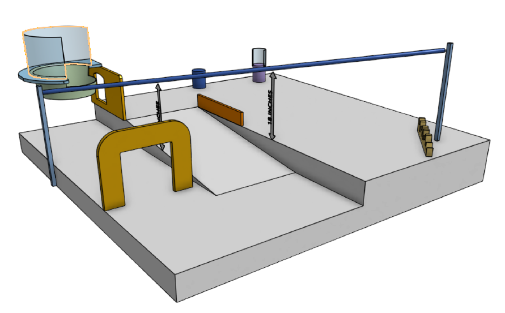

# enph-253-pet-rescue

## Overview
This project is a fully autonomous robot designed for ENPH 253 to compete in the 2025 Engineering Physics Robot Summer Competition at UBC. The cometition theme this year was Pet Rescue and goal was to drive around a course, find animal plushies in need of saving, retrieve them, and return them to the beginning of the course. Our team (team 4) of four Engineering Physics students designed and built the mechanical, electrical, and software components of this robot in 6 weeks to complete these tasks. Our team's strategy was to collect each of the pets into a basket and then lift that basket onto the zip-line to rescue them.

## Meet the Team

- [Luca Jones](https://github.com/Luca-Jones)
- [Harchetan Chohan](https://github.com/HarchetanChohan)
- [Taichi Kamei](https://github.com/Ta1k25)
- [Coen Molyneaux](https://github.com/Coen-Molyneaux)

## Mechanical Design

The mechanical design was done with Onshape as our CAD tool. It is simple to use and allows for collaboration and version control. Many different manufacturing techniques were used such as 3D printing, laser jet cutting, water jet cutting, lathing, and milling.

### Chassis

The chassis was built out of hardboard and reinforced with water-jet cut aluminium bars. This component required the most communication to perfect as every other part of the robot needs to screw into it.

### Arm

The arm and claw together were responsible for grasping each pet and placing them into the bucket in the rear. The base of the arm is attached to a lazy suzan which is bolted to the chassis, allowing it to easily rotate and pick up pets in different directions. The base also had teeth to mesh with another gear driven by a DC motor. A magnetic rotation encoder was placed underneath the base which provided the feedback needed to create a servo and set an absolute position. The arm is designed as a 4 bar linkage, allowing the servo motors that drive its vertical movement to be located at its base rather than on the hinge. The claw also uses a 4 bar linkage so that the pinsors remain parallel and reach forwards as the claw closes.

### Cascading Lift

The cascading lift mechanism was responsible for lifting the basket that stored each of the pets onto the zip line that would bring them back to the start of the course. The cascading lift works by winding a rope around a spool and extending a cabinet slider through a series of pulleys. This system proved to be extremely effective. Unlike a scissor lift, the mechanical difficulty in lifting happens near the end of the motion rather than at the beginning, allowing us to easily provide enough torque to lift our desired weight.

## Electrical Design

### H-bridge Motor Driver

### IR Sensors

### I2C Buffer and Multiplexer

### Magnetic encoder

## Software Architecture

